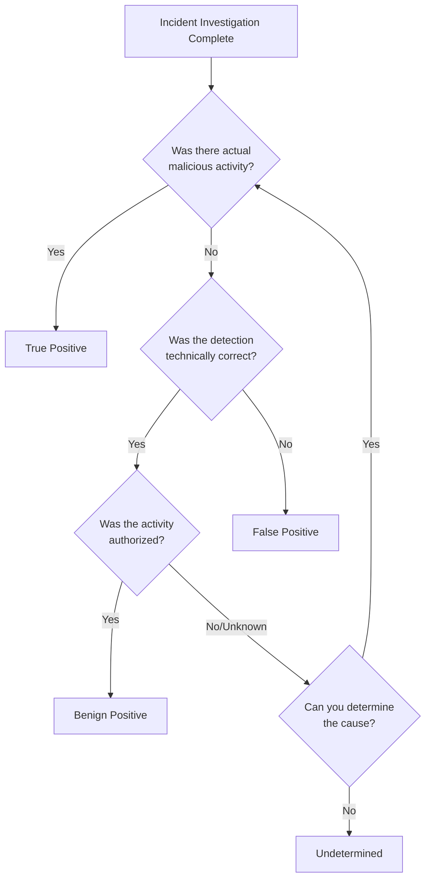

Properly classifying incidents is essential for accurate reporting, tuning detection rules, and understanding your security posture. This guide explains when to use each classification type.

## Classification vs Status

Before diving into classifications, it's important to understand the difference between **Status** and **Classification**:

<CardGroup cols={2}>
  <Card title="Status" icon="circle-dot">
    **Work state** of the investigation

    - **New** — Not yet reviewed
    - **Active** — Under investigation
    - **Closed** — Investigation complete
  </Card>
  <Card title="Classification" icon="tags">
    **Outcome** of the investigation

    - True Positive
    - False Positive
    - Benign Positive
    - Undetermined
  </Card>
</CardGroup>

<Info>
  **Status** tracks _where you are_ in the investigation process. **Classification** documents _what you found_ when the investigation is complete.
</Info>

---

## Classification Types

### True Positive

<Card title="True Positive" icon="circle-check" color="#22c55e">
  The incident represents an **actual security threat** that required response.
</Card>

**When to use:**

- Confirmed malicious activity was detected
- A real attack or compromise occurred
- Threat actor activity was identified
- Malware, phishing, or unauthorized access was verified

**Examples:**

- User credentials were actually compromised
- Malware was confirmed running on an endpoint
- Data exfiltration attempt was verified
- Unauthorized access to sensitive resources occurred

<Tip>
  True Positives validate that your detection rules are working correctly. Document the threat details in comments for future reference.
</Tip>

---

### Benign Positive

<Card title="Benign Positive" icon="circle-info" color="#3b82f6">
  The detection was **technically correct**, but the activity was **legitimate** and authorized.
</Card>

**When to use:**

- Suspicious-looking activity was actually authorized
- A user performed unusual but legitimate actions
- IT/Admin activities triggered security alerts
- Penetration testing or security assessments caused alerts

**Examples:**

- Admin legitimately accessed multiple systems during maintenance
- User traveled and logged in from an unusual location
- Authorized penetration test triggered alerts
- New software deployment caused unusual process behavior

<Tip>
  Benign Positives help identify opportunities for tuning. Consider creating exceptions or adjusting detection thresholds for known legitimate activities.
</Tip>

---

### False Positive

<Card title="False Positive" icon="circle-xmark" color="#ef4444">
  The incident was **incorrectly triggered** due to flawed detection logic or bad data.
</Card>

**When to use:**

- Detection rule logic is flawed or too broad
- Inaccurate or corrupted data triggered the alert
- Misconfiguration caused incorrect detection
- The alert has no basis in actual activity

**Sub-classifications:**

| Reason                    | Description                                                                 |
| ------------------------- | --------------------------------------------------------------------------- |
| **Inaccurate data**       | The data used to generate the alert was incorrect, incomplete, or corrupted |
| **Incorrect alert logic** | The detection rule itself is flawed and needs to be modified or disabled    |

**Examples:**

- Alert triggered on a non-existent user due to log parsing error
- Detection rule matches normal business activity too broadly
- Time zone misconfiguration caused false temporal correlation
- Deprecated system generated alerts for decommissioned resources

<Warning>
  False Positives indicate detection problems that should be addressed. Report patterns of False Positives to improve detection quality.
</Warning>

---

### Undetermined

<Card title="Undetermined" icon="circle-question" color="#a855f7">
  The investigation was **inconclusive**—the cause or outcome couldn't be determined.
</Card>

**When to use:**

- Insufficient evidence to reach a conclusion
- Logs or data needed for investigation are unavailable
- The incident doesn't fit other classification categories
- Investigation was abandoned due to resource constraints

**Examples:**

- Relevant logs expired before investigation completed
- Activity was suspicious but couldn't be verified either way
- Source system was decommissioned, preventing further analysis
- Alert context was insufficient for determination

<Tip>
  When using Undetermined, always add detailed comments documenting what was discovered during the investigation. This helps if the incident needs to be revisited later.
</Tip>

---

## Quick Reference

| Classification      | Meaning                                | Action                                             |
| ------------------- | -------------------------------------- | -------------------------------------------------- |
| **True Positive**   | Real threat confirmed                  | Document threat details, validate response actions |
| **Benign Positive** | Correct detection, authorized activity | Consider tuning or adding exceptions               |
| **False Positive**  | Incorrect detection                    | Report for rule improvement                        |
| **Undetermined**    | Inconclusive investigation             | Document findings in comments                      |

---

## Classification Decision Tree

Use this flow to determine the correct classification:

---

## Best Practices

<AccordionGroup>
  <Accordion title="Always add comments">
    Document your investigation findings regardless of classification. This creates an audit trail and helps with future investigations of similar incidents.
  </Accordion>
  <Accordion title="Be consistent">
    Work with your team to establish classification guidelines. Consistent classification improves metrics accuracy and detection tuning.
  </Accordion>
  <Accordion title="Review patterns">
    Regularly review classification trends. High False Positive rates indicate detection rules that need tuning. High Benign Positive rates suggest exception lists need updating.
  </Accordion>
  <Accordion title="Don't default to Undetermined">
    Use Undetermined only when you genuinely cannot determine the outcome. Overuse of Undetermined reduces the value of your classification data.
  </Accordion>
</AccordionGroup>

---

## Related Guides

<CardGroup cols={2}>
  <Card title="Incident Management" icon="book" href="/guides/getting-started/incident-management">
    Complete workflow for managing incidents.
  </Card>
  <Card title="Workbench Overview" icon="screwdriver-wrench" href="/guides/getting-started/workbench-overview">
    Complete workbench to manage your incident resolution.
  </Card>
</CardGroup>

---

<Note>
  Questions about classifications? Contact us at [support@contraforce.com](mailto:support@contraforce.com).
</Note>