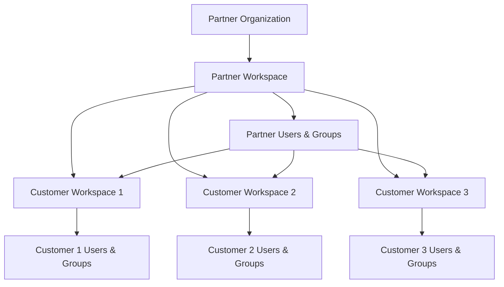
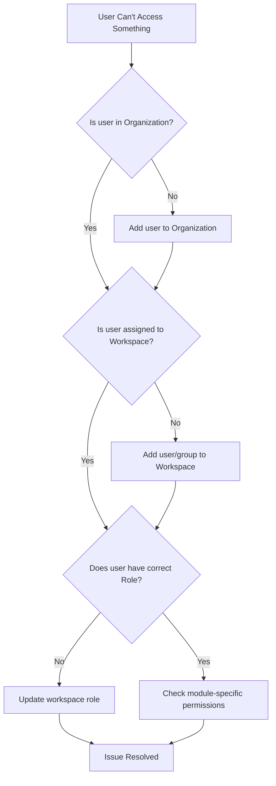

This guide addresses the most common challenges MSP/MSSP partners face when setting up user and group management in ContraForce. Understanding the relationship between parent (partner) and child (customer) workspaces is essential for a smooth onboarding experience.

## **Recommended Default Groups**

Setting up default groups during initial configuration saves time and ensures consistent access patterns.

**Suggested Partner Groups**

| Group Name            | Description                                 | Suggested Workspace Role     |
| :-------------------- | :------------------------------------------ | :--------------------------- |
| SOC Tier 1            | Front-line analysts handling initial triage | Incident Analyst             |
| SOC Tier 2            | Senior analysts with response capabilities  | Incident Responder           |
| SOC Managers          | Team leads overseeing operations            | Admin                        |
| Integration Engineers | Technical staff managing connectors         | Data Source Admin            |
| Account Managers      | Customer relationship managers              | Incident Analyst (read-only) |

> ## For Azure Administrators
>
> For MSP/MSSP teams already fluent in Azure and Entra administration, ContraForce's user and group management model will feel intuitive once you establish these mental mappings:
>
> 1. Organization = Root Management Group: The top-level scope where you establish identities that can flow down
> 2. Workspace = Subscription / Administrative Unit: The isolation boundary where customer-specific access lives
> 3. Organization Groups = Inherited RBAC: Create once, assign many times, automatic access when group membership changes
> 4. Workspace Users = AU-scoped delegation: Strictly bounded to one customer's data
> 5. Two locations = Two scopes: Just like Azure has IAM blades at different levels, ContraForce has Organization Settings and Workspace Settings
>
> The key transferable skill is **thinking hierarchically about access scope**—a discipline your team has already developed managing Azure governance at scale.

<Info>
  This guide is specifically designed for **MSP/MSSP partners** managing multiple customer workspaces. If you're a single-tenant customer, see the standard [User Management](/guides/general-support/user-management) guide.
</Info>

## Understanding the Two-Tier Model

ContraForce uses a two-tier user management model that separates partner-level access from customer-level access. This is the **most important concept** to understand before configuring users and groups.

<CardGroup cols={2}>
  <Card title="Parent (Partner) Level" icon="building">
    Your organization's workspace where you manage your team and oversee all customer workspaces
  </Card>
  <Card title="Child (Customer) Level" icon="buildings">
    Individual customer workspaces where you manage customer-specific users and access
  </Card>
</CardGroup>

### How the Tiers Work Together

<Warning>
  **Key Insight:** Users and groups created at the **child (customer) level** are only visible within that specific workspace. Users and groups created at the **parent (partner) level** can be assigned access across ALL workspaces.
</Warning>

---

## The Two Places for User & Group Management

One of the most common points of confusion is that there are **two different locations** to manage users and groups, each serving a different purpose.

### Location 1: Organization Settings (Partner Level)

**Path:** Settings → User Management

This is where you manage users and groups for your **partner organization**:

| What You Manage      | Scope                       |
| -------------------- | --------------------------- |
| Partner team members | Access to all workspaces    |
| Partner user groups  | Cross-workspace permissions |
| Organizational roles | Partner-level capabilities  |

<Frame>
  
</Frame>

### Location 2: Workspace Settings (Customer Level)

**Path:** Workspaces → [Select Customer] → Equalizer → Users & Groups

This is where you manage users and groups for a **specific customer workspace**:

| What You Manage          | Scope               |
| ------------------------ | ------------------- |
| Customer users           | This workspace only |
| Customer groups          | This workspace only |
| Workspace-specific roles | This workspace only |

<Frame>
  
</Frame>

### Quick Reference: Where to Go

| I Want To...                                                 | Go To                 |
| ------------------------------------------------------------ | --------------------- |
| Add a partner analyst who needs access to multiple customers | Organization Settings |
| Create a group for your SOC team to access all workspaces    | Organization Settings |
| Add a customer's IT admin to view their own workspace        | Workspace Settings    |
| Create a customer-specific group                             | Workspace Settings    |
| Manage your own organization's users                         | Organization Settings |
| Grant a customer limited access to their incidents           | Workspace Settings    |

---

## Parent vs Child: When to Use Each

### Use Parent (Organization) Level When:

<AccordionGroup>
  <Accordion title="Adding your own team members (SOC analysts, engineers)">
    Your internal team needs access to multiple or all customer workspaces. Adding them at the organization level lets you assign them to any workspace without recreating their account.

    **Example:** Adding a new SOC analyst who will handle incidents for 10 customers.
  </Accordion>
  <Accordion title="Creating groups for your internal teams">
    Create groups like "Tier 1 Analysts," "Tier 2 Engineers," or "Account Managers" at the organization level, then assign these groups to relevant workspaces.

    **Example:** Create a "SOC Team" group, add your analysts, then assign this group to all customer workspaces.
  </Accordion>
  <Accordion title="Setting up cross-workspace permissions">
    When you need consistent permissions across multiple customers, define them at the organization level.

    **Example:** All Tier 1 analysts should have "Incident Responder" role across all customer workspaces.
  </Accordion>
</AccordionGroup>

### Use Child (Workspace) Level When:

<AccordionGroup>
  <Accordion title="Adding customer users who only access their own data">
    Customers who need to view their own incidents, reports, or dashboards should be added at the workspace level.

    **Example:** Adding a customer's CISO who wants to review their security incidents.
  </Accordion>
  <Accordion title="Creating customer-specific groups">
    Groups that only make sense for a specific customer should be created at the workspace level.

    **Example:** A customer's "Security Committee" group that reviews monthly reports.
  </Accordion>
  <Accordion title="Granting limited access to customer stakeholders">
    When customers need read-only or limited access to their workspace.

    **Example:** A customer's compliance officer who needs incident audit access.
  </Accordion>
</AccordionGroup>

---

## Step-by-Step: Setting Up Partner Users

### Adding a Partner Team Member

<Steps>
  <Step title="Navigate to Organization Settings">
    Go to **Settings** → **User Management**
  </Step>
  <Step title="Click Add User">
    Click the **Add User** button
  </Step>
  <Step title="Enter User Details">
    Enter the user's email address (must match their Microsoft Entra ID account)
  </Step>
  <Step title="Assign Organizational Role">
    Select the appropriate organization-level role:

    - **Organization Admin** — Full platform access
    - **Organization Member** — Standard access
  </Step>
  <Step title="Save User">
    Click **Save** to create the user
  </Step>
  <Step title="Assign to Workspaces">
    Assign the user to specific customer workspaces (see next section)
  </Step>
</Steps>

### Assigning Users to Customer Workspaces

After creating a user at the organization level, grant them access to customer workspaces:

<Steps>
  <Step title="Go to Workspaces">
    Navigate to the **Workspaces** page
  </Step>
  <Step title="Select Customer Workspace">
    Click on the customer workspace you want to configure
  </Step>
  <Step title="Open Workspace Settings">
    Click the **gear icon** to open workspace settings
  </Step>
  <Step title="Go to Users & Groups">
    Select the **Users & Groups** tab
  </Step>
  <Step title="Add User or Group">
    Add the organization user or group to this workspace
  </Step>
  <Step title="Assign Workspace Role">
    Select the role for this specific workspace:

    - **Admin** — Full workspace control
    - **Incident Responder** — Investigate and respond
    - **Incident Analyst** — View and analyze
    - **Data Source Admin** — Manage integrations
  </Step>
</Steps>

---

## Step-by-Step: Setting Up Groups

Groups simplify permission management by letting you assign roles to multiple users at once.

### Creating an Organization Group

<Steps>
  <Step title="Navigate to Organization Settings">
    Go to **Settings** → **User Management** → **Groups** tab
  </Step>
  <Step title="Click Create Group">
    Click **Create Group**
  </Step>
  <Step title="Name the Group">
    Enter a descriptive name (e.g., "SOC Tier 1 Analysts")
  </Step>
  <Step title="Add Members">
    Select users to add to this group
  </Step>
  <Step title="Save Group">
    Click **Save** to create the group
  </Step>
</Steps>

### Assigning a Group to Workspaces

<Steps>
  <Step title="Go to Workspace Settings">
    Navigate to the customer workspace → gear icon → **Users & Groups**
  </Step>
  <Step title="Click Add Group">
    Click **Add Group**
  </Step>
  <Step title="Select Organization Group">
    Choose the group from your organization
  </Step>
  <Step title="Assign Role">
    Select the workspace role for all group members
  </Step>
  <Step title="Save">
    Click **Save** to apply
  </Step>
</Steps>

<Tip>
  **Best Practice:** Create groups at the organization level and assign them to workspaces. This way, when you add a new team member to a group, they automatically get access to all workspaces that group is assigned to.
</Tip>

---

## Recommended Default Groups

Setting up default groups during initial configuration saves time and ensures consistent access patterns.

### Suggested Partner Groups

| Group Name                | Description                                 | Suggested Workspace Role     |
| ------------------------- | ------------------------------------------- | ---------------------------- |
| **SOC Tier 1**            | Front-line analysts handling initial triage | Incident Analyst             |
| **SOC Tier 2**            | Senior analysts with response capabilities  | Incident Responder           |
| **SOC Managers**          | Team leads overseeing operations            | Admin                        |
| **Integration Engineers** | Technical staff managing connectors         | Data Source Admin            |
| **Account Managers**      | Customer relationship managers              | Incident Analyst (read-only) |

### Setting Up Default Groups

<Steps>
  <Step title="Create Groups First">
    Before onboarding customers, create your standard groups at the organization level
  </Step>
  <Step title="Add Team Members">
    Add your team members to the appropriate groups
  </Step>
  <Step title="Document Group Purposes">
    Document what each group is for and what role it should receive
  </Step>
  <Step title="Apply to New Workspaces">
    When onboarding new customers, assign these groups with consistent roles
  </Step>
</Steps>

<Info>
  **Pro Tip:** Create a simple spreadsheet mapping your groups to workspace roles. This becomes your "template" for onboarding new customers and ensures consistency.
</Info>

---

## Common Permission Scenarios

### Scenario 1: New SOC Analyst Joining Your Team

**Goal:** Add a new analyst who needs to handle incidents for all customers.

<Steps>
  <Step title="Create User at Organization Level">
    Settings → User Management → Add User → Enter email → Save
  </Step>
  <Step title="Add to SOC Group">
    Add user to your "SOC Tier 1" or appropriate group
  </Step>
  <Step title="Verify Workspace Access">
    The user automatically inherits access to all workspaces the group is assigned to
  </Step>
</Steps>

### Scenario 2: Customer Wants to View Their Incidents

**Goal:** Give a customer's security team read-only access to their workspace.

<Steps>
  <Step title="Go to Customer Workspace">
    Workspaces → Select Customer → Gear Icon
  </Step>
  <Step title="Add Customer User">
    Users & Groups → Add User → Enter customer email
  </Step>
  <Step title="Assign Analyst Role">
    Select "Incident Analyst" role for read-only access
  </Step>
</Steps>

### Scenario 3: Partner User Can't Access a Workspace

**Goal:** Troubleshoot why a partner user can't see a specific customer workspace.

<Steps>
  <Step title="Check Organization Membership">
    Verify the user exists in Settings → User Management
  </Step>
  <Step title="Check Group Membership">
    Verify the user is in a group that has workspace access
  </Step>
  <Step title="Check Workspace Assignment">
    Go to the workspace settings and verify the user or their group is listed
  </Step>
  <Step title="Check Role Assignment">
    Ensure a workspace role is assigned (not just added to the workspace)
  </Step>
</Steps>

### Scenario 4: User Has Wrong Permissions

**Goal:** User can view incidents but can't respond to them.

**Cause:** User has "Incident Analyst" role instead of "Incident Responder."

<Steps>
  <Step title="Go to Workspace Settings">
    Navigate to the affected workspace
  </Step>
  <Step title="Find the User or Group">
    Locate in Users & Groups
  </Step>
  <Step title="Update Role">
    Change role from Incident Analyst to Incident Responder
  </Step>
  <Step title="Save Changes">
    Click Save to apply
  </Step>
</Steps>

---

## Workspace Roles Reference

| Role                   | View Incidents | Respond to Incidents | Manage Gamebooks | Configure Modules | Manage Users |
| ---------------------- | :------------: | :------------------: | :--------------: | :---------------: | :----------: |
| **Admin**              | ✓              | ✓                    | ✓                | ✓                 | ✓            |
| **Incident Responder** | ✓              | ✓                    | ✓                | —                 | —            |
| **Incident Analyst**   | ✓              | —                    | —                | —                 | —            |
| **Data Source Admin**  | ✓              | —                    | —                | ✓                 | —            |
| **Content Admin**      | ✓              | —                    | —                | CMS Only          | —            |

<Card title="Full Roles Reference" icon="users" href="/guides/technical/contraforce-user-roles">
  View complete permissions for all roles
</Card>

---

## Troubleshooting

### Common Issues

| Issue                                            | Cause                         | Solution                                           |
| ------------------------------------------------ | ----------------------------- | -------------------------------------------------- |
| **User can't see any workspaces**                | Not assigned to any workspace | Add user/group to workspaces in workspace settings |
| **User can see workspace but can't do anything** | No role assigned              | Assign a workspace role to the user or their group |
| **User can't add modules**                       | Insufficient role             | User needs Admin or Data Source Admin role         |
| **Can't add users to workspace**                 | Not a workspace Admin         | Need Admin role on that workspace                  |
| **Group changes not reflected**                  | Caching                       | Refresh browser; changes may take a few minutes    |
| **Customer user sees other customers' data**     | Added at wrong level          | Remove from org level, add only at workspace level |

### Permission Troubleshooting Flow

---

## Best Practices

<AccordionGroup>
  <Accordion title="Create groups before onboarding customers">
    Set up your standard groups (SOC Tier 1, Tier 2, Managers, etc.) before onboarding any customers. This creates a consistent template to follow.
  </Accordion>
  <Accordion title="Use groups instead of individual user assignments">
    Assigning groups to workspaces instead of individual users makes it much easier to onboard new team members—just add them to the appropriate group.
  </Accordion>
  <Accordion title="Document your group-to-role mappings">
    Create a simple reference document showing which groups get which roles. This ensures consistency across all customer onboardings.
  </Accordion>
  <Accordion title="Keep customer users at the workspace level only">
    Never add customer users at the organization level unless they need cross-workspace access. This prevents accidental data exposure.
  </Accordion>
  <Accordion title="Use consistent naming conventions">
    Name groups clearly (e.g., "SOC-Tier1-Analysts" not "Group1") so anyone can understand their purpose.
  </Accordion>
  <Accordion title="Audit permissions periodically">
    Review user and group assignments quarterly to remove departed employees and ensure permissions are still appropriate.
  </Accordion>
  <Accordion title="Test with a non-admin account">
    After setting up permissions, test access with a non-admin account to verify users see what they should see.
  </Accordion>
</AccordionGroup>

---

## Onboarding Checklist

Use this checklist when onboarding a new customer workspace:

### Pre-Onboarding (One-Time Setup)

- Create standard organization groups (SOC Tier 1, Tier 2, etc.)
- Add your team members to appropriate groups
- Document group-to-role mappings

### Per-Customer Onboarding

- Create/configure customer workspace
- Assign organization groups to workspace with appropriate roles
- Verify partner team can access the workspace
- Add customer users at workspace level (if needed)
- Create customer-specific groups (if needed)
- Test access with a non-admin account
- Document any customer-specific permission requirements

---

## Frequently Asked Questions

<AccordionGroup>
  <Accordion title="Why are there two places to manage users?">
    The two locations serve different purposes: Organization Settings manages your partner team (who may need access to multiple customers), while Workspace Settings manages access to a specific customer (including customer users who should only see their own data).
  </Accordion>
  <Accordion title="Can a customer user see other customers' data?">
    Not if set up correctly. Customer users should only be added at the workspace level, not at the organization level. This ensures they can only see their own workspace.
  </Accordion>
  <Accordion title="What's the fastest way to give a new analyst access to all customers?">
    Add them to an organization group that's already assigned to all customer workspaces. They'll inherit access automatically.
  </Accordion>
  <Accordion title="Can I have different roles for the same user in different workspaces?">
    Yes. A user might be an Admin in one workspace and an Incident Responder in another. Roles are assigned per-workspace.
  </Accordion>
  <Accordion title="What happens if I remove a user from a group?">
    They lose access to all workspaces that group was assigned to (unless they have individual access or belong to another group with access).
  </Accordion>
  <Accordion title="Can customers manage their own users?">
    Yes, if you give them the Admin role on their workspace. They can then add/remove users within their workspace only.
  </Accordion>
</AccordionGroup>

---

## Related Guides

<CardGroup cols={2}>
  <Card title="Roles & Permissions Reference" icon="user-shield" href="/guides/technical/contraforce-user-roles">
    Complete permissions for each role
  </Card>
  <Card title="Workspace Manager" icon="building" href="https://docs.contraforce.com/guides/getting-started/workspaces#workspace-manager">
    Managing customer workspaces
  </Card>
  <Card title="Onboarding Overview" icon="rocket" href="/guides/onboarding/microsoft-sentinel-onboarding">
    Full onboarding process
  </Card>
  <Card title="Multi-Tenant Features" icon="buildings" href="/guides/getting-started/multi-tenant-features">
    Cross-workspace management
  </Card>
</CardGroup>

---

<Note>
  Questions about user and group management? Contact us at [support@contraforce.com](mailto:support@contraforce.com) or request hands-on onboarding support for your first few customer deployments.
</Note>