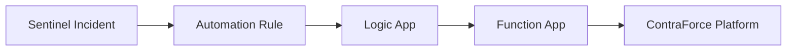

This article documents all Azure resources that ContraForce provisions during the onboarding process. Use this reference to understand what's deployed in your environment, verify deployments, and plan for offboarding if needed.

<Info>
The resources deployed depend on your module selection (XDR vs XDR + SIEM) and whether you enable AI Agents. Not all resources apply to every deployment.
</Info>

## Deployment Overview

ContraForce deploys resources across several Azure components:

<CardGroup cols={2}>
  <Card title="Enterprise Applications" icon="key">
    Service principals in Microsoft Entra ID for API access and authentication
  </Card>
  <Card title="Azure Lighthouse" icon="tower-broadcast">
    Cross-tenant delegation for MSSP management scenarios
  </Card>
  <Card title="Apollo Infrastructure" icon="bolt">
    Real-time incident notification system for Sentinel
  </Card>
  <Card title="Agent Infrastructure" icon="robot">
    AI agent hosting environment (optional)
  </Card>
</CardGroup>

### Resources by Module

| Resource Category | XDR Module | XDR + SIEM Module | With AI Agents |
|-------------------|:----------:|:-----------------:|:--------------:|
| Core Enterprise Applications | ✓ | ✓ | ✓ |
| Defender Enterprise Applications | ✓ | ✓ | ✓ |
| Azure Lighthouse | — | ✓ | ✓ |
| Apollo Resource Group | — | ✓ | ✓ |
| Sentinel Resource Deployments | — | ✓ | ✓ |
| Agent Center Resource Group | — | — | ✓ |
| Per-Agent Resource Groups | — | — | ✓ |

---

## Phase 1: Initial Onboarding

The first phase provisions core enterprise applications required for all ContraForce deployments.

### Enterprise Applications

These applications are provisioned and consented during initial setup:

| Application | Application ID | Purpose |
|-------------|----------------|---------|
| **ContraForce API** | `24d97bc0-8f2b-45d5-8e0b-7fe286732ef2` | Core platform API access |
| **ContraForce Portal** | `8b7cb435-9526-47ee-b79a-34433f0daad2` | User authentication and portal access |

<Info>
These two applications are required for all ContraForce deployments, regardless of module selection. They are consented during the first step of the onboarding wizard.
</Info>

### Permissions Granted

| Application | Permission Type | Permissions |
|-------------|-----------------|-------------|
| **ContraForce API** | Application | SecurityEvents.Read.All, User.Read.All |
| **ContraForce Portal** | Delegated | User.Read, openid, profile |

---

## Phase 2: Module-Specific Applications

Additional enterprise applications are consented based on your module selection and enabled features.

### Microsoft Defender XDR Applications

| Application | Application ID | Purpose |
|-------------|----------------|---------|
| **ContraForce for MDE** | `6efccc6a-f0d3-49e5-92d0-17d4afa9ba52` | Defender for Endpoint data access |
| **ContraForce Gamebooks for MDE** | `ad7b0e79-3c37-4408-bf8f-eb89522cc920` | Endpoint response actions |

### Identity Applications

| Application | Application ID | Purpose |
|-------------|----------------|---------|
| **ContraForce Gamebooks for Identity** | `36b0d51c-4c0f-4810-9cc4-bfbd40c7dd4a` | User response actions (disable, reset password) |
| **ContraForce User Management** | `460b65b7-3a5e-4a2c-98d0-e48fd35374a9` | User and group management |

### Microsoft Sentinel Applications

| Application | Application ID | Purpose |
|-------------|----------------|---------|
| **ContraForce Sentinel Hunting** | `6bf1c74d-7ade-4671-a507-166936f89a1f` | Log Analytics queries for threat hunting |

### Email Applications

| Application | Application ID | Purpose |
|-------------|----------------|---------|
| **ContraForce Gamebooks for Email** | `44dbf6fe-45e3-48a3-bac3-f8d4cf1dba6d` | Email response actions (soft delete) |

---

## Phase 3: Microsoft Sentinel Core Components

For XDR + SIEM deployments, additional Azure resources establish the connection between your Sentinel environment and ContraForce.

<Warning>
This phase only applies to **XDR + SIEM module** deployments. XDR-only deployments skip this phase.
</Warning>

### Azure Lighthouse Delegation

Azure Lighthouse enables cross-tenant management without credential sharing.

| Resource | Type | Description |
|----------|------|-------------|
| **ContraForceLighthouseDeployment** | ARM Template | Assigns Sentinel resource group to ContraForce tenant |

#### What Lighthouse Enables

- Cross-tenant visibility into your Sentinel workspace
- Incident management without logging into your tenant
- Centralized management for MSSPs

<Tip>
Azure Lighthouse is the Microsoft-recommended approach for MSSP scenarios. It provides secure delegated access without sharing credentials or creating guest accounts.
</Tip>

### Role Assignments

| Principal | Role | Scope |
|-----------|------|-------|
| **ContraForce API** | Sentinel Contributor | Sentinel Resource Group |
| **ContraForce API** | Reader | Sentinel Resource Group |

### Resource Provider Registrations

The following resource providers are registered in your subscription:

| Resource Provider | Purpose |
|-------------------|---------|
| **Microsoft.Network** | Network resources for Apollo deployment |
| **Microsoft.Storage** | Storage accounts for Apollo deployment |

---

## Phase 4: Apollo Resource Group

Apollo enables real-time Sentinel incident notifications. A dedicated resource group is created with supporting infrastructure.

### Resource Group Details

| Property | Value |
|----------|-------|
| **Name** | `rg-contraforce-apollo` |
| **Purpose** | Real-time incident notification infrastructure |
| **Location** | Same region as your Sentinel workspace |

### Resources Deployed

<AccordionGroup>
  <Accordion title="Compute Resources">
    | Resource | Type | Purpose |
    |----------|------|---------|
    | **Function App** | Microsoft.Web/sites | Processes incident events |
    | **App Service Plan** | Microsoft.Web/serverfarms | Hosts the Function App |
  </Accordion>
  <Accordion title="Monitoring Resources">
    | Resource | Type | Purpose |
    |----------|------|---------|
    | **Log Analytics Workspace** | Microsoft.OperationalInsights/workspaces | Apollo diagnostics and logging |
    | **Application Insights** | Microsoft.Insights/components | Function App monitoring |
  </Accordion>
  <Accordion title="Storage Resources">
    | Resource | Type | Purpose |
    |----------|------|---------|
    | **Storage Account** | Microsoft.Storage/storageAccounts | Function App storage |
  </Accordion>
  <Accordion title="Security Resources">
    | Resource | Type | Purpose |
    |----------|------|---------|
    | **Apollo Role Definition** | Microsoft.Authorization/roleDefinitions | Custom role for Apollo access |
    | **Role Assignment** | Microsoft.Authorization/roleAssignments | Apollo RG to Lighthouse delegation |
  </Accordion>
</AccordionGroup>

### Apollo Architecture

---

## Phase 5: Sentinel Resource Group Deployments

Resources are also deployed directly into your existing Sentinel resource group to enable incident streaming.

### Resources in Sentinel Resource Group

| Resource | Type | Name |
|----------|------|------|
| **API Connection** | Microsoft.Web/connections | `microsoftsentinel-Publish-Incident-To-Apollo` |
| **Logic App** | Microsoft.Logic/workflows | `Publish-Incident-To-Apollo` |
| **Automation Rule** | Microsoft.SecurityInsights/automationRules | `Run-Playbook-Publish-Incident-To-Apollo` |

### How Incident Streaming Works

<Steps>
  <Step title="Incident Created">
    A new incident is created in Microsoft Sentinel
  </Step>
  <Step title="Automation Rule Triggers">
    The `Run-Playbook-Publish-Incident-To-Apollo` automation rule detects the new incident
  </Step>
  <Step title="Logic App Executes">
    The `Publish-Incident-To-Apollo` Logic App is triggered
  </Step>
  <Step title="Incident Sent">
    The Logic App sends incident data to the Apollo Function App
  </Step>
  <Step title="ContraForce Updated">
    The incident appears in the ContraForce Command Page in near real-time
  </Step>
</Steps>

---

## Phase 6: Agent Center Resource Group (Optional)

If you deploy ContraForce AI Agents, a dedicated resource group hosts the core agent infrastructure.

<Info>
AI Agents are an optional feature. Most deployments do not include agent infrastructure. Skip this section if you haven't enabled AI Agents.
</Info>

### Resource Group Details

| Property | Value |
|----------|-------|
| **Name** | `rg-cf-agent-center` |
| **Purpose** | Core infrastructure for ContraForce AI agents |
| **Location** | Configured during agent deployment |

### Resources Deployed

<AccordionGroup>
  <Accordion title="AI Resources">
    | Resource | Type | Purpose |
    |----------|------|---------|
    | **AI Foundry** | Microsoft.MachineLearningServices/workspaces | AI model management |
    | **CosmosDB** | Microsoft.DocumentDB/databaseAccounts | Agent data storage |
  </Accordion>
  <Accordion title="Compute Resources">
    | Resource | Type | Purpose |
    |----------|------|---------|
    | **Container Apps Environment** | Microsoft.App/managedEnvironments | Agent runtime environment |
    | **Container App (Infrastructure)** | Microsoft.App/containerApps | Infrastructure management |
    | **Log Analytics Workspace** | Microsoft.OperationalInsights/workspaces | Container Apps logging |
  </Accordion>
  <Accordion title="Network Resources">
    | Resource | Type | Purpose |
    |----------|------|---------|
    | **Virtual Network (VNET)** | Microsoft.Network/virtualNetworks | Network isolation |
    | **Azure Subnet** | Subnet | Container Apps subnet |
    | **Private Endpoint Subnet** | Subnet | Private endpoints |
    | **Cosmos DNS Zone** | Microsoft.Network/privateDnsZones | CosmosDB DNS resolution |
    | **Key Vault DNS Zone** | Microsoft.Network/privateDnsZones | Key Vault DNS resolution |
    | **CosmosDB Private Endpoint** | Microsoft.Network/privateEndpoints | Secure CosmosDB access |
    | **Key Vault Private Endpoint** | Microsoft.Network/privateEndpoints | Secure Key Vault access |
  </Accordion>
  <Accordion title="Security Resources">
    | Resource | Type | Purpose |
    |----------|------|---------|
    | **Key Vaults** | Microsoft.KeyVault/vaults | Secret management |
    | **Managed Identity** | Microsoft.ManagedIdentity/userAssignedIdentities | Container App authentication |
  </Accordion>
  <Accordion title="Storage Resources">
    | Resource | Type | Purpose |
    |----------|------|---------|
    | **Storage Account** | Microsoft.Storage/storageAccounts | Infrastructure management storage |
  </Accordion>
</AccordionGroup>

---

## Phase 7: Per-Agent Resource Groups (Optional)

A dedicated resource group is created for each AI agent deployed per workspace.

### Resource Group Naming

| Property | Pattern |
|----------|---------|
| **Name Format** | `rg-cf-agent-{agent-id}` |
| **Example** | `rg-cf-agent-abc123` |

### Resources Per Agent

| Resource | Type | Purpose |
|----------|------|---------|
| **AI Foundry Project** | Microsoft.MachineLearningServices/workspaces/projects | Agent-specific AI project |
| **OpenAI Model Deployment** | Microsoft.CognitiveServices/accounts/deployments | LLM for agent reasoning |
| **Container App** | Microsoft.App/containerApps | Agent application runtime |

<Tip>
Each workspace can have multiple agents, each with its own resource group. Monitor your Azure costs if you deploy many agents across many workspaces.
</Tip>

---

## Complete Resource Summary

### By Deployment Type

<Tabs>
  <Tab title="XDR Only">
    **Enterprise Applications:**
    - ContraForce API
    - ContraForce Portal
    - ContraForce for MDE
    - ContraForce Gamebooks for MDE
    - ContraForce Gamebooks for Identity
    - ContraForce User Management
    - ContraForce Gamebooks for Email
    
    **Azure Resources:** None
  </Tab>
  <Tab title="XDR + SIEM">
    **Enterprise Applications:**
    - All XDR applications
    - ContraForce Sentinel Hunting
    
    **Azure Resources:**
    - Azure Lighthouse delegation
    - Role assignments (Sentinel Contributor, Reader)
    - Apollo Resource Group (`rg-contraforce-apollo`)
    - Sentinel Logic App and API Connection
    - Sentinel Automation Rule
  </Tab>
  <Tab title="With AI Agents">
    **Enterprise Applications:**
    - All XDR + SIEM applications
    
    **Azure Resources:**
    - All XDR + SIEM resources
    - Agent Center Resource Group (`rg-cf-agent-center`)
    - Per-Agent Resource Groups (`rg-cf-agent-*`)
  </Tab>
</Tabs>

### Enterprise Application Quick Reference

| Application | App ID | Required For |
|-------------|--------|--------------|
| ContraForce API | `24d97bc0-8f2b-45d5-8e0b-7fe286732ef2` | All deployments |
| ContraForce Portal | `8b7cb435-9526-47ee-b79a-34433f0daad2` | All deployments |
| ContraForce for MDE | `6efccc6a-f0d3-49e5-92d0-17d4afa9ba52` | Endpoint visibility |
| ContraForce Gamebooks for MDE | `ad7b0e79-3c37-4408-bf8f-eb89522cc920` | Endpoint response |
| ContraForce Gamebooks for Identity | `36b0d51c-4c0f-4810-9cc4-bfbd40c7dd4a` | User response |
| ContraForce User Management | `460b65b7-3a5e-4a2c-98d0-e48fd35374a9` | User management |
| ContraForce Sentinel Hunting | `6bf1c74d-7ade-4671-a507-166936f89a1f` | Threat hunting |
| ContraForce Gamebooks for Email | `44dbf6fe-45e3-48a3-bac3-f8d4cf1dba6d` | Email response |

---

## Verifying Deployed Resources

### Check Enterprise Applications

<Steps>
  <Step title="Open Entra ID">
    Navigate to [entra.microsoft.com](https://entra.microsoft.com)
  </Step>
  <Step title="Go to Enterprise Applications">
    Click **Identity** > **Applications** > **Enterprise applications**
  </Step>
  <Step title="Search for ContraForce">
    Search for "ContraForce" to see all provisioned applications
  </Step>
  <Step title="Verify Status">
    Each application should show "Enabled" status
  </Step>
</Steps>

### Check Azure Resources

<Steps>
  <Step title="Open Azure Portal">
    Navigate to [portal.azure.com](https://portal.azure.com)
  </Step>
  <Step title="Search Resource Groups">
    Search for "contraforce" or "cf-agent" in resource groups
  </Step>
  <Step title="Verify Resources">
    Open each resource group and confirm expected resources exist
  </Step>
</Steps>

### Check Role Assignments

<Steps>
  <Step title="Navigate to Sentinel Resource Group">
    Find your Sentinel resource group in Azure Portal
  </Step>
  <Step title="Open Access Control">
    Click **Access control (IAM)**
  </Step>
  <Step title="View Role Assignments">
    Click **Role assignments** tab
  </Step>
  <Step title="Find ContraForce">
    Search for "ContraForce" to verify assignments
  </Step>
</Steps>

---

## Cost Considerations

### Included Resources

Most ContraForce resources have minimal Azure cost impact:

| Resource Type | Typical Cost |
|---------------|--------------|
| Enterprise Applications | Free |
| Azure Lighthouse | Free |
| Role Assignments | Free |
| Logic App (Consumption) | ~$0.01-1/month |
| Function App (Consumption) | ~$1-5/month |

### Potentially Significant Costs

<Warning>
AI Agent deployments can incur significant Azure costs depending on usage:

- **AI Foundry / OpenAI**: Pay-per-token pricing
- **Container Apps**: Compute costs based on usage
- **CosmosDB**: Storage and throughput costs

Monitor your Azure spending if you enable AI Agents.
</Warning>

---

## Troubleshooting

### Common Issues

| Issue | Possible Cause | Solution |
|-------|---------------|----------|
| **Missing enterprise apps** | Consent incomplete | Re-run consent flow in workspace settings |
| **Apollo resource group missing** | Deployment failed | Check deployment history in Azure; contact support |
| **Logic App not running** | Disabled or failed | Enable the Logic App in Azure Portal |
| **No incidents syncing** | Automation rule disabled | Enable the automation rule in Sentinel |
| **Role assignment missing** | Manual removal | Re-run onboarding or manually add assignments |

### Viewing Deployment History

<Steps>
  <Step title="Open Subscription">
    Navigate to your Azure subscription
  </Step>
  <Step title="Go to Deployments">
    Click **Deployments** in the left navigation
  </Step>
  <Step title="Find ContraForce Deployments">
    Search for "ContraForce" or "Apollo"
  </Step>
  <Step title="Review Status">
    Check deployment status and error messages
  </Step>
</Steps>

---

## Related Guides

<CardGroup cols={2}>
  <Card title="Sentinel Onboarding" icon="database" href="/guides/onboarding/microsoft-sentinel-onboarding">
    Complete SIEM module deployment guide
  </Card>
  <Card title="XDR Onboarding" icon="shield-halved" href="/guides/onboarding/microsoft-defender-xdr-onboarding">
    XDR module deployment guide
  </Card>
  <Card title="Enterprise Applications" icon="key" href="/guides/technical/contraforce-enterprise-applications">
    Service principal details and permissions
  </Card>
  <Card title="Offboarding Procedure" icon="trash" href="/guides/technical/contraforce-offboarding-procedure">
    How to remove all ContraForce resources
  </Card>
</CardGroup>

---

<Note>
Questions about deployed resources? Contact us at [support@contraforce.com](mailto:support@contraforce.com).
</Note>